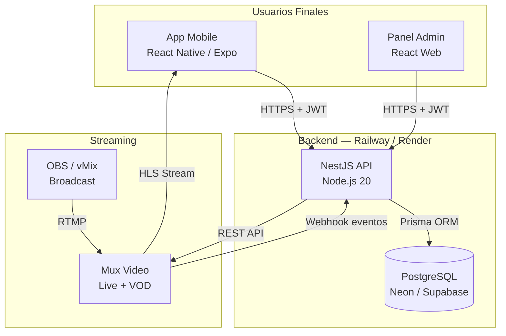

# INVS Platform — Guía de Despliegue y Servicios en Producción

> Documento técnico para el equipo de INVS.  
> Versión 1.0 — Junio 2026

---

## 1. Arquitectura General



### Flujo principal

1. Usuario se registra/loguea → recibe **Access Token (15min)** + **Refresh Token (30d, cookie HttpOnly)**
2. Token se adjunta en header `Authorization: Bearer <token>` a cada request
3. Backend valida token, verifica suscripción si aplica y responde
4. QR tickets: generados con **HMAC-SHA256** firmado — el staff escanea y valida contra BD
5. Streaming: API genera **signed playback URL** de Mux válida por tiempo limitado (1h)

---

## 2. Servicios a Contratar

### 2.1 Infraestructura del Backend

| Servicio | Plan Recomendado MVP | Costo Aprox. | Link |
|----------|---------------------|--------------|------|
| **Railway** | Hobby / Pro | USD 5–20/mes | [railway.app](https://railway.app) |
| **Neon (PostgreSQL)** | Free → Pro | USD 0–19/mes | [neon.tech](https://neon.tech) |
| **Alternativa todo-en-uno** | Supabase Pro | USD 25/mes | [supabase.com](https://supabase.com) |

> **Recomendación MVP**: Railway (API) + Neon (DB) = desde **USD 5–25/mes** total

#### ¿Por qué Railway?
- Deploy desde GitHub con `git push` — sin configurar servidores
- Variables de entorno en UI
- Logs en tiempo real
- PostgreSQL disponible como servicio interno (alternativa a Neon)
- Escala automáticamente

---

### 2.2 Streaming de Video

| Servicio | Plan | Costo | Notas |
|----------|------|-------|-------|
| **Mux** | Pay-as-you-go | ~USD 0.015/min live + USD 0.007/min VOD | [mux.com](https://mux.com) |
| **Mux** | Starter (hasta 1000min/mes) | USD 50–100/mes aprox. | Recomendado para MVP |
| **Vimeo OTT** | Alternativa | USD 50–200/mes | Más simple, menos control |

> **Mux es la recomendación**: se paga por uso real, tiene SDK de Node.js oficial, y los `signed playback URLs` funcionan out-of-the-box para contenido restringido.

**Qué cubre Mux:**
- Ingest RTMP (broadcast desde OBS, vMix, celular)
- Transcodificación automática (HLS adaptive bitrate)
- CDN global
- DVR / grabación automática del live
- VOD (video on demand) para la biblioteca de grabaciones
- Thumbnails automáticos

---

### 2.3 Aplicaciones Móviles (Distribución)

| Plataforma | Costo | Renovación | Link |
|-----------|-------|------------|------|
| **Apple Developer Program** | USD 99 | Anual | [developer.apple.com](https://developer.apple.com) |
| **Google Play Console** | USD 25 | Pago único | [play.google.com/console](https://play.google.com/console) |

> ⚠️ **Importante sobre In-App Purchases (suscripciones digitales):**
> Si la app vende suscripciones directamente dentro de iOS/Android, **Apple se queda el 30% (15% para pequeños negocios)**. 
> Estrategia recomendada MVP: las suscripciones se gestionan manualmente o desde la web (sin IAP nativo), evitando la comisión de las tiendas.

---

### 2.4 Servicios Opcionales / Adicionales

| Servicio | Para qué | Costo |
|---------|---------|-------|
| **Cloudflare** | CDN + protección DDoS (gratis) | Free |
| **Resend / SendGrid** | Emails transaccionales (bienvenida, tickets) | Free tier → USD 20/mes |
| **Sentry** | Monitoreo de errores en producción | Free → USD 26/mes |
| **Upstash Redis** | Rate limiting avanzado / caché | Free → USD 10/mes |

---

## 3. Costos Totales Estimados (MVP)

| Concepto | Costo Mensual |
|---------|--------------|
| Railway (API) | USD 5–20 |
| Neon PostgreSQL | USD 0–19 |
| Mux Video (1–2 eventos/mes) | USD 30–80 |
| Apple Developer (prorrateado) | USD 8 |
| Google Play (prorrateado) | ~USD 0 |
| **TOTAL MVP mensual** | **USD 43–127/mes** |

> El mayor costo variable es Mux: depende de minutos de streaming y almacenamiento de grabaciones.

---

## 4. Guía de Despliegue en Railway

### 4.1 Pre-requisitos

- Cuenta en [railway.app](https://railway.app) (vincular con GitHub)
- Cuenta en [neon.tech](https://neon.tech) (crear proyecto PostgreSQL)
- Cuenta en [mux.com](https://mux.com) (obtener API keys)
- Repositorio del backend en GitHub

### 4.2 Paso a Paso

#### Paso 1: Preparar el repositorio

```bash
# Clonar y entrar al directorio
cd invs-backend

# Copiar el .env de ejemplo
cp .env.example .env

# Generar secretos seguros
node -e "console.log(require('crypto').randomBytes(64).toString('hex'))"
# Copiar el resultado dos veces: uno para JWT_ACCESS_SECRET, otro para JWT_REFRESH_SECRET

node -e "console.log(require('crypto').randomBytes(32).toString('hex'))"
# Copiar el resultado para QR_HMAC_SECRET
```

#### Paso 2: Configurar base de datos (Neon)

1. Ir a [neon.tech](https://neon.tech) → **New Project** → nombre: `invs-prod`
2. Copiar el **Connection String** (formato: `postgresql://...`)
3. Guardarlo como `DATABASE_URL` en las variables de Railway

#### Paso 3: Desplegar en Railway

```bash
# Instalar Railway CLI (una vez)
npm install -g @railway/cli

# Login
railway login

# Inicializar proyecto (desde la carpeta invs-backend)
railway init

# Desplegar
railway up
```

**O desde la UI de Railway:**
1. New Project → Deploy from GitHub Repo
2. Seleccionar el repo `invs-backend`
3. Railway detecta automáticamente Node.js

#### Paso 4: Variables de entorno en Railway

En Railway → tu proyecto → **Variables**, agregar:

```
NODE_ENV=production
PORT=3000
DATABASE_URL=postgresql://...          # De Neon
JWT_ACCESS_SECRET=...                  # Generado en paso 1
JWT_ACCESS_EXPIRES_IN=15m
JWT_REFRESH_SECRET=...                 # Generado en paso 1
JWT_REFRESH_EXPIRES_IN=30d
QR_HMAC_SECRET=...                     # Generado en paso 1
MUX_TOKEN_ID=...                       # De dashboard.mux.com
MUX_TOKEN_SECRET=...                   # De dashboard.mux.com
MUX_WEBHOOK_SECRET=...                 # De dashboard.mux.com → Webhooks
MUX_SIGNED_URL_TTL=3600
CORS_ORIGINS=https://admin.invs.app,https://invs.app
```

#### Paso 5: Ejecutar migraciones en producción

```bash
# Una vez que la API esté desplegada, correr desde Railway CLI:
railway run npm run prisma:migrate:deploy

# Opcionalmente sembrar datos iniciales (solo primera vez):
railway run npm run prisma:seed
```

#### Paso 6: Configurar Mux Webhook

1. Ir a [dashboard.mux.com](https://dashboard.mux.com) → Webhooks → **Create webhook**
2. URL: `https://tu-api.railway.app/api/v1/streaming/mux-webhook`
3. Seleccionar eventos: `video.live_stream.active`, `video.live_stream.idle`, `video.asset.ready`
4. Copiar el **Signing Secret** → colocarlo en `MUX_WEBHOOK_SECRET`

---

## 5. Estructura del Backend (Resumen)

```
invs-backend/
├── src/
│   ├── auth/           # JWT + Refresh Tokens
│   ├── users/          # Perfil y gestión de usuarios
│   ├── subscriptions/  # Planes y suscripciones
│   ├── events/         # CRUD de eventos
│   ├── tickets/        # Generación y validación QR (HMAC-SHA256)
│   ├── streaming/      # Mux Live + signed tokens
│   ├── recordings/     # Biblioteca de grabaciones VOD
│   ├── common/         # Guards, decorators, filters
│   ├── prisma/         # Servicio de BD
│   └── main.ts         # Bootstrap con Swagger, Helmet, CORS
├── prisma/
│   ├── schema.prisma   # Modelos: User, Subscription, Event, Ticket, Recording
│   └── seed.ts         # Datos iniciales
├── docker-compose.yml  # Desarrollo local (PostgreSQL + API)
├── Dockerfile          # Multi-stage (dev/build/prod)
└── .env.example        # Template de variables de entorno
```

---

## 6. Endpoints Principales de la API

Base URL: `https://tu-api.railway.app/api/v1`  
Swagger UI: `http://localhost:3000/docs` (solo en desarrollo)

### Auth
| Método | Ruta | Descripción |
|--------|------|-------------|
| POST | `/auth/register` | Registro de usuario |
| POST | `/auth/login` | Login → access + refresh token |
| POST | `/auth/refresh` | Renovar access token |
| POST | `/auth/logout` | Cerrar sesión |

### Events
| Método | Ruta | Descripción |
|--------|------|-------------|
| GET | `/events` | Listar eventos (público, con filtros) |
| GET | `/events/:id` | Detalle de evento |
| POST | `/events` | Crear evento 🔒 Admin |
| PATCH | `/events/:id` | Editar evento 🔒 Admin |
| DELETE | `/events/:id` | Eliminar evento 🔒 Admin |

### Tickets / QR
| Método | Ruta | Descripción |
|--------|------|-------------|
| POST | `/tickets` | Generar ticket QR 🔒 Suscriptor |
| GET | `/tickets/me` | Mis tickets 🔒 |
| POST | `/tickets/validate` | Validar QR escaneado 🔒 Staff/Admin |
| GET | `/tickets/event/:id` | Tickets de un evento 🔒 Admin/Staff |

### Streaming
| Método | Ruta | Descripción |
|--------|------|-------------|
| GET | `/streaming/:eventId/token` | Token HLS firmado 🔒 Suscriptor |
| POST | `/streaming/:eventId/create` | Crear live stream en Mux 🔒 Admin |
| POST | `/streaming/mux-webhook` | Webhook Mux (sin auth) |

### Recordings
| Método | Ruta | Descripción |
|--------|------|-------------|
| GET | `/recordings` | Biblioteca de grabaciones 🔒 Suscriptor |
| GET | `/recordings/:id/token` | Token de reproducción 🔒 Suscriptor |
| POST | `/recordings` | Agregar grabación 🔒 Admin |

---

## 7. Seguridad Implementada

| Mecanismo | Descripción |
|-----------|-------------|
| **JWT + Refresh Tokens** | Access token corto (15min), refresh token largo en cookie HttpOnly |
| **Refresh tokens hasheados** | El refresh token se guarda en BD con bcrypt (no en texto plano) |
| **HMAC-SHA256 en QR** | Cada ticket está firmado digitalmente — imposible falsificar |
| **timingSafeEqual** | Prevención de timing attacks en validación de QR |
| **Anti-reutilización** | Cada QR tiene flag `used` + `usedAt` en BD |
| **TTL en QR** | Los tickets vencen 4h después del evento |
| **Signed Playback URLs** | Los tokens de Mux vencen en 1h — no se puede compartir el link |
| **Helmet** | Headers de seguridad HTTP automáticos |
| **ValidationPipe** | Whitelist estricto: se rechazan propiedades no declaradas en DTOs |
| **RolesGuard** | Control de acceso por rol: USER, STAFF, ADMIN |
| **SubscriptionGuard** | Verifica suscripción activa antes de servir contenido premium |

---

## 8. Desarrollo Local (Arrancar en 2 comandos)

### Requisitos
- Node.js 20+
- Docker Desktop

```bash
# 1. Entrar al directorio
cd invs-backend

# 2. Copiar variables de entorno
cp .env.example .env
# Editar .env con tus secretos (al menos los JWT y QR)

# 3. Instalar dependencias
npm install

# 4. Levantar PostgreSQL con Docker
docker-compose up postgres -d

# 5. Correr migraciones
npm run prisma:migrate:dev

# 6. Sembrar datos de prueba
npm run prisma:seed

# 7. Arrancar en modo desarrollo (hot-reload)
npm run start:dev
```

API disponible en: `http://localhost:3000/api/v1`  
Swagger UI en: `http://localhost:3000/docs`

### Credenciales de prueba (después del seed)
- **Admin**: `admin@invs.app` / `Admin123!`
- **Staff**: `staff@invs.app` / `Staff123!`
- **Demo**: `demo@invs.app` / `Demo123!` (con suscripción premium activa)

---

## 9. Checklist Pre-Producción

### Seguridad
- [ ] Generar secretos criptográficamente seguros (no dejar los del ejemplo)
- [ ] `NODE_ENV=production` en variables de entorno
- [ ] CORS configurado con los dominios reales (no localhost)
- [ ] Webhook secret de Mux configurado y verificado

### Base de datos
- [ ] Backup automático activado en Neon/Supabase
- [ ] Migraciones aplicadas con `prisma:migrate:deploy` (no `:dev`)
- [ ] Seed de producción ejecutado (admin inicial creado)

### Aplicación
- [ ] Dominio personalizado configurado en Railway
- [ ] SSL automático verificado (Railway lo provee)
- [ ] Health check endpoint disponible (`GET /api/v1/health`)
- [ ] Logs habilitados y monitoreados (Railway tiene logs en tiempo real)

### Mux
- [ ] Webhook registrado y activo
- [ ] Playback policies configuradas como `signed` (no públicas)
- [ ] Testeado flujo completo: crear stream → emitir → grabar → reproducir

### Tiendas de aplicaciones
- [ ] Apple Developer Program activado (USD 99)
- [ ] Google Play Console activado (USD 25)
- [ ] Build de producción de la app generado y subido

---

## 10. Roadmap Sugerido Post-MVP

1. **Panel Admin web** (React + la misma API) para gestión sin Postman
2. **Push notifications** (Expo Push / Firebase) para notificar eventos próximos
3. **Pagos web** (Stripe / Mercado Pago) para suscripciones desde web sin comisión de Apple
4. **In-App Purchases** nativos (React Native IAP) si se decide monetizar desde las tiendas
5. **Caché** (Redis via Upstash) para eventos y grabaciones populares
6. **Rate limiting** por IP y por usuario para prevenir abuso
7. **Email transaccional** (Resend) para confirmación de tickets y bienvenida

---

*Documento generado para INVS — Plataforma de Eventos. Actualizar ante cambios de infraestructura.*
